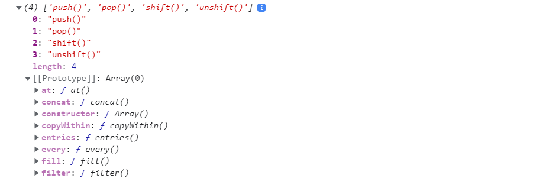

# Массивы в JavaScript


Массив в JavaScript - это упорядоченная структура данных, где коллекция элементов пронумерована и хранится в том порядке, как ее записали. Элементы могут быть любого типа, даже в рамках одного массива. Такая гибкость позволяет создавать, например, массив массивов или массив объектов. Возможное количество элементов не превышает 232. Нумерация массива начинается с нуля, а максимальный индекс элемента равен 4294967294 (232–2).

Синтаксис
Есть два способа записи нового массива, для примера создадим пустые.

    
    let newArr = []
    
Вариант с квадратными скобками прост в записи и используется чаще.

    
    let newArr = new Array()
    
Если при вызове конструктора Array() прописать один аргумент, будет создан пустой массив заданной длины.

    
    let newArr = new Array(10)
    
Это может быть актуально, если заранее известна длина массива, но на практике квадратные скобки всегда проще.

Количество элементов в массиве в JavaScript может увеличиваться или уменьшаться по мере необходимости, таким образом нет надобности заранее задавать четкие границы.
Для того, чтобы создать массив с элементами необходимо перечислить их через запятую.

    
    let arrayMethods = ['push()', 'pop()', 'shift()', 'unshift()',]
    console.log(arrayMethods)
    
Если вывести arrayMethods в console можно увидеть его структуру: элементы с индексами, а также методы, доступные для работы с массивом. На скриншоте показана только часть методов



В конце последнего элемента массива может стоять запятая, она называется «висячей» и помогает, когда дело доходит до перестановки элементов местами.
Получить элемент массива
Для этого необходимо указать индекс элемента в квадратных скобках.

    
    let arrayMethods = ['toString()', 'splice()', 'slice()', 'concat()']
    console.log(arrayMethods[3]) // concat()
    
Главное не забывать, что отсчет элементов начинается с нуля.

Заменить элемент
    
    let arrayMethods = ['toString()', 'splice()', 'slice()', 'concat()']
    arrayMethods[2] = 'push()' // slice() будет заменен на push()
    
Добавить новый
    
    let arrayMethods = ['toString()', 'splice()', 'slice()', 'concat()']
    arrayMethods[4] = 'push()'
    
Добавить новый элемент в уже существующий массив можно указав новый индекс напрямую в квадратных скобках. Это может быть как следующий за последним, так и другой индекс, например, 20-й или 41-й. Если добавить элемент с индексом больше чем длина массива, такой массив будет называться разреженный, а при попытке обратиться к промежуточным (несуществующим) элементам получим undefined.

    
    let arrayMethods = ['toString()', 'splice()', 'slice()', 'concat()']
    arrayMethods[14] = 'push()'
    console.log(arrayMethods[8]) // undefined
        
    let newArr = [1,2,3,,,,4] // ,,, - такая запись тоже создаст разреженный массив
    console.log(newArr.length) // 7
    console.log(newArr[5]) // undefined
    
Длина массива - length
Массивы в JavaScript имеют свойство length, где хранится информация о его размере. В не разреженных массивах значение свойства равняется количеству элементов, а также индексу последнего элемента + 1, для разреженных массивов актуально только последнее.

    
    let arrayMethods = ['toString()', 'splice()', 'slice()', 'concat()']
    console.log(arrayMethods.length) // 4
    
Запросив значение свойства length, получим 4, что сходится с количеством элементов. Если добавить элементы в массив или удалить их, значение length обновиться автоматически.

    
    let arrayMethods = ['toString()', 'splice()', 'slice()', 'concat()']
    arrayMethods[10] = 'push()'
    console.log(arrayMethods.length) // 11
    
В данном случае добавили в массив новый элемент с индексом 10, и получили значение свойства length равным 11.

Получить последний элемент
Получить последний элемент массива можно двумя способами:

оперируя свойством length

    
    let arrayMethods = ['push()', 'pop()', 'shift()', 'unshift()']
    alert(arrayMethods[arrayMethods.length - 1]) // unshift()
    
или используя метод at()

    
    let arrayMethods = ['push()', 'pop()', 'shift()', 'unshift()']
    alert(arrayMethods.at(-1)) // unshift()
    
Добавление / удаление элементов - методы
Помимо работы с элементами напрямую, JavaScript позволяет манипулировать содержанием массива с помощью методов, перечислим некоторые:

pop() - удаляет последний элемент и возвращает его значение.

    
    let arrayMethods = ['toString()', 'splice()', 'slice()', 'concat()']
    let lastElem = arrayMethods.pop()
    console.log(lastElem) // concat()
    console.log(arrayMethods) // получим массив без последнего элемента
    
push() - добавляет элементы в конец и возвращает новую длину массива.

 let arrayMethods = ['toString()', 'splice()', 'slice()', 'concat()']
    let addedElems = arrayMethods.push('shift()', 'unshift()')
    console.log(addedElems) // 6 - новая длина
    console.log(arrayMethods) // массив с добавленными элементами
    
shift() - удаляет первый элемент и возвращает его значение.

    
    let arrayMethods = ['toString()', 'splice()', 'slice()', 'concat()']
    let removedFirstElem = arrayMethods.shift()
    console.log(removedFirstElem) // toString()
    console.log(arrayMethods) // массив без первого элемента
    
unshift() - добавляет элементы в начало и возвращает новую длину массива.

    
    let arrayMethods = ['toString()', 'splice()', 'slice()', 'concat()']
    let addedElems = arrayMethods.unshift('shift()', 'unshift()')
    console.log(addedElems) // 6
    console.log(arrayMethods) // массив с добавленными элементами
    
Методы которые удаляют или добавляют элементы в начале массива работают медленнее, чем те, которые делают тоже самое, но в конце. В первом случае программе необходимо сдвинуть все элементы влево или вправо и пронумеровать всё заново, во-втором нумеровать нужно только новые элементы, а двигать ничего не надо.
Перебор элементов массива
Есть несколько способов, как можно обойти элементы массива:

С помощью цикла for

    
    let arrayMethods = ['toString()', 'splice()', 'slice()', 'concat()']
    for (let i = 0; i < arrayMethods.length; i++) {
        console.log(arrayMethods[i])
    }        
    
С помощью цикла for..of

    
    let arrayMethods = ['toString()', 'splice()', 'slice()', 'concat()']
    for (let method of arrayMethods) {
        console.log(method)
    }                
    
Многомерные массивы
В JavaScript нет специального функционала для создания многомерных массивов, но есть возможность имитировать такие конструкции с помощью массивов, где каждый элемент это тоже массив.

    
    let newArray = [
        [1, 2, 3],
        [4, 5, 6],
        [7, 8, 9],
    ]
    console.log(newArray[2][2]) // 9      
    
Итого
Массив в JavaScript - это особая разновидность объекта, которая предоставляет множество удобных методов для работы с упорядоченными структурами данными. Вместо ключа, как в объекте, в массиве используется индекс, который присваивается каждому элементу автоматически. Индекс первого элемента 0, индекс второго 1, индекс третьего 2 и так далее.

1. Доступ к элементам массива осуществляется посредством записи в квадратные скобки [] нужного индекса:
```js
    
    let arrayMethods = ['toString()', 'splice()', 'slice()',] // Создаем массив
    arrayMethods[3] = 'concat()' // Добавили новый элемент
    let getElem = arrayMethods[1] // Записали в переменную splice()
    arrayMethods[0] = 'push()' // заменили значение первого элемента на push()

```

2. Добавлять и удалять элементы массива можно с помощью методов.

pop() - удаляет последний элемент и возвращает его значение.

push() - добавляет элементы в конец и возвращает новую длину массива.

shift() - удаляет первый элемент и возвращает его значение.

unshift() - добавляет элементы в начало и возвращает новую длину массива.

3. Перебирать элементы массива удобно используя циклы for и for..of

